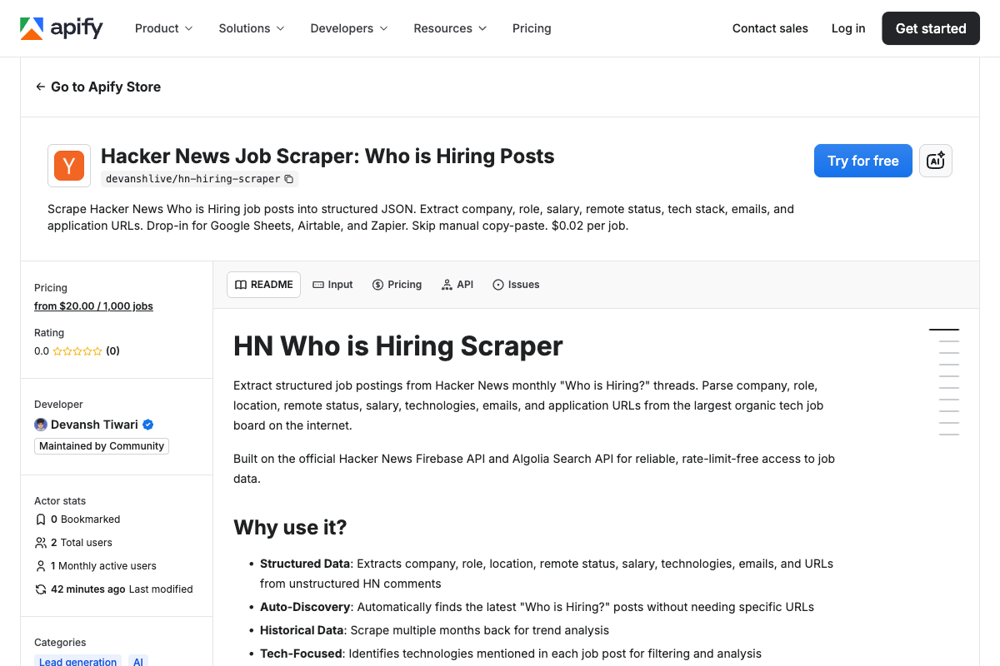

<div align="center">

# HN Hiring Scraper | Tech Job Data Extraction API | Apify Actor

[](https://apify.com/getascraper/hn-hiring-scraper)
[](https://nodejs.org/)
[](https://github.com/getascraper)
[](https://github.com/getascraper/how-to-scrape-hn-hiring)

**Hacker News hiring scraper and tech job data extraction API. Extract job posts, companies, and tech roles from HN Who is Hiring with this Apify actor. Free tier included.**

Built for job seekers, recruiting teams, and developers who need structured hiring data from Hacker News without manual parsing.

[Quick Start](#quick-start) · [API Reference](#api-reference) · [Pricing](#pricing) · [Support](#support)



</div>

---

## Quick Start

```javascript
import { ApifyClient } from 'apify-client';
import 'dotenv/config';

const client = new ApifyClient({ token: process.env.APIFY_TOKEN });

const run = await client.actor('getascraper/hn-hiring-scraper').call({
  monthsBack: 1,
  maxJobsPerMonth: 10,
  includeReplies: false,
});

const { items } = await client.dataset(run.defaultDatasetId).listItems();
console.log(items);
```

**Output:**
```json
{
  "commentId": 123456789,
  "hnUser": "hiring_manager",
  "postedAt": 1704067200,
  "postedAtIso": "2024-01-01T00:00:00Z",
  "rawText": "We're hiring senior engineers...",
  "cleanText": "We're hiring senior engineers...",
  "company": "TechCorp",
  "role": "Senior Engineer",
  "location": "San Francisco, CA",
  "remoteStatus": "REMOTE",
  "employmentType": "Full-time",
  "salary": "$150k - $200k",
  "technologies": ["React", "Node.js", "PostgreSQL"],
  "emails": ["jobs@techcorp.com"],
  "urls": ["https://techcorp.com/jobs"],
  "isTopLevel": true,
  "parentId": null,
  "replyCount": 5,
  "hnUrl": "https://news.ycombinator.com/item?id=123456789"
}
```

---

## Features

- **Auto-discovers latest threads** no need to find URLs manually
- **Structured parsing** extracts company, role, salary, remote status, and tech stack
- **Multiple months** in one run with configurable lookback
- **Reply filtering** include or exclude replies and nested comments
- **Tech stack extraction** automatically identifies mentioned technologies

---

## What this actor does

This Actor extracts job postings from Hacker News monthly "Who is Hiring?" threads. It auto-discovers the latest threads, parses structured data from comments, and returns clean JSON.

It supports configurable lookback periods, job limits per month, and reply filtering. Each posting includes company, role, location, salary, remote status, and tech stack.

---

## Installation

```bash
npm install
```

Copy the environment file and add your Apify API token:

```bash
cp .env.example .env
```

Open `.env` and replace `your_apify_token_here` with your actual Apify API token. Get one free at [console.apify.com](https://console.apify.com/settings/integrations).

---

## Input

| Field | Type | Description | Default |
|-------|------|-------------|---------|
| `monthsBack` | integer | How many months to look back | 1 |
| `maxJobsPerMonth` | integer | Max jobs per month | 100 |
| `includeReplies` | boolean | Include reply comments | false |
| `startUrls` | array | Optional specific thread URLs | none |

---

## Output

Each job is a structured JSON record. Download as JSON, CSV, Excel, or HTML.

| Field | Description |
|-------|-------------|
| `commentId` | Unique HN comment ID |
| `hnUser` | HN username who posted the job |
| `postedAt` | Unix timestamp of the post |
| `postedAtIso` | ISO timestamp of the post |
| `rawText` | Original comment text |
| `cleanText` | Parsed and cleaned text |
| `company` | Company name (extracted from post) |
| `role` | Job role/title |
| `location` | Job location |
| `remoteStatus` | REMOTE, ONSITE, HYBRID, etc. |
| `employmentType` | Full-time, Contract, Intern, etc. |
| `salary` | Salary range if found in text |
| `technologies` | Technologies mentioned in the post |
| `emails` | Email addresses found |
| `urls` | Application/company URLs found |
| `isTopLevel` | Whether this is a top-level job post |
| `parentId` | Parent comment ID |
| `replyCount` | Number of replies to this job post |
| `hnUrl` | Direct link to the comment on HN |

See `sample-output.json` for a full example.

---

## Pricing

**$0.02 per job.**

A run of 100 jobs typically completes in 1 to 2 minutes. Pay only for what you extract.

---

## Use Cases

- **Job search automation:** Build personalized job alerts from HN hiring threads
- **Tech hiring trends:** Analyze which technologies and companies are hiring most
- **Remote work tracking:** Filter for remote positions across multiple months
- **Recruiting intelligence:** Monitor competitor hiring patterns and tech stack preferences
- **Salary benchmarking:** Extract salary ranges for role and location comparison

---

## FAQ

**How does auto-discovery work?**
The Actor automatically finds the latest "Who is Hiring?" threads on Hacker News. No manual URL collection needed.

**Can I search specific months?**
Yes. Use `monthsBack` to control how many months to look back. Set to 1 for just the latest month.

**What tech stacks are detected?**
The Actor automatically detects technologies mentioned in job posts: programming languages, frameworks, databases, cloud platforms, and tools.

---

## Support

Open an issue in the [Apify Console](https://console.apify.com/actors/getascraper~hn-hiring-scraper/issues).

---

## Related Resources

- [Hacker News API documentation](https://github.com/HackerNews/API)
- [Apify Client for JavaScript](https://docs.apify.com/api/client/js/)

---

**Ready to start extracting?**

[Open the HN Hiring Scraper on Apify](https://apify.com/getascraper/hn-hiring-scraper)
